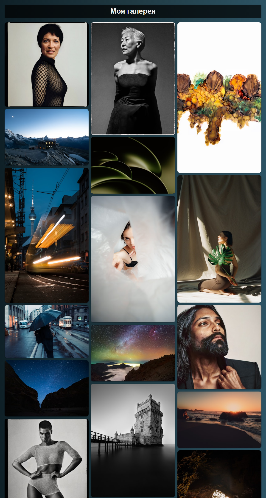
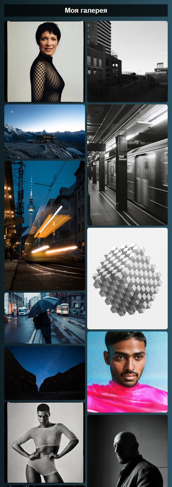
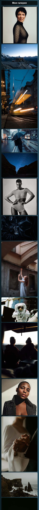
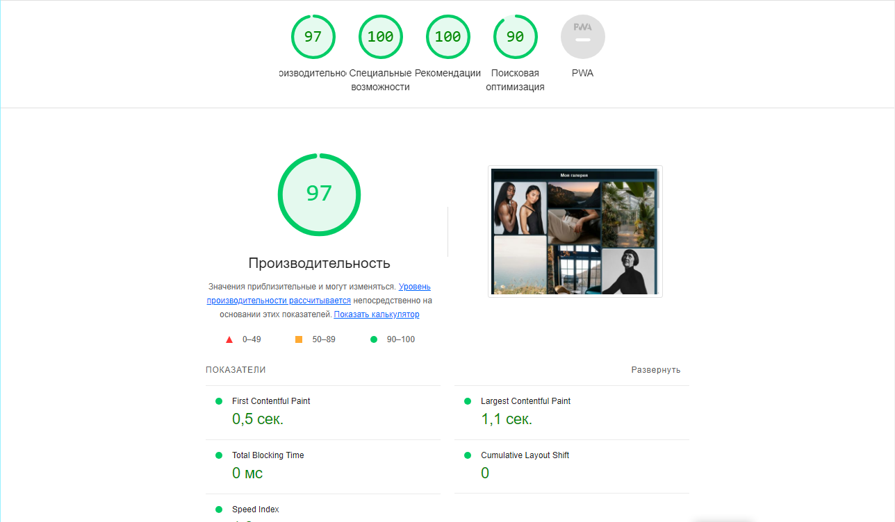

# [Главная страница галереи](https://asalferova.github.io/EndlessFeed/ "Ссылка на сайт")

## Описание проекта

Этот проект представляет собой веб-приложение, которое отображает бесконечную ленту изображений, загруженных с Unsplash. Используя API Unsplash, приложение динамически загружает и отображает изображения по мере прокрутки пользователем страницы.

   Технологии: HTML, CSS, JavaScript, Fetch API, Unsplash API.

   Основные функции:

   * Динамическая загрузка изображений: Приложение использует fetch API для асинхронной загрузки изображений с Unsplash. Каждый запрос к API включает в себя номер страницы, что позволяет загружать новые изображения по мере прокрутки страницы.
   * Адаптивный макет: Используются CSS Grid и медиа-запросы.

Этот проект демонстрирует мои навыки в области веб-разработки, включая работу с API, асинхронное программирование и создание адаптивных макетов с использованием CSS Grid.

## Скриншоты сайта

Здесь представлены три скриншота сайта:

1. Скриншот десктопной версии сайта
 

2. Скриншот планшетной версии сайта

3. Скриншот мобильной версии сайта

## Аналитика сайта

Сайт проанализирован встроенным инструментом chrome браузера Lighthouse

